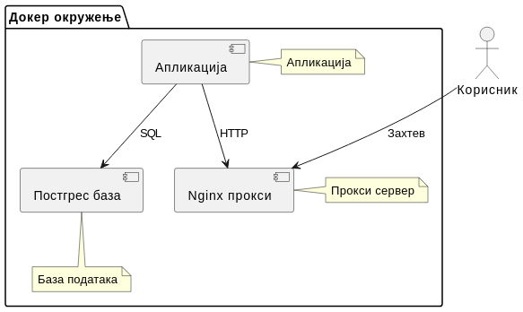

# СПЦ Регистар

[](https://github.com/zenariworks/crkva/actions/workflows/pylint.yml)

## Опис пројекта

СПЦ Регистар је дигитални систем за вођење евиденције Српске Православне Цркве. Омогућава ефикасно управљање црквеним записима, укључујући крштења, венчања и друге важне догађаје.

## Садржај

- [Предуслови](#предуслови)
- [Први кораци](#први-кораци)
- [Производно окружење](#производно-окружење)
- [Развој и тестирање](#развој-и-тестирање)
- [Додатне белешке](#додатне-белешке)

## Предуслови

Пре него што започнете, потребно је да имате следеће софтвере инсталиране на вашем систему:

- [Docker](https://www.docker.com/products/docker-desktop)
- [Docker Compose](https://docs.docker.com/compose/install/)

Пратите упутства за инсталацију на званичним вебсајтовима.

## Први кораци

### 1. Инсталација и подешавање

   ```bash
   docker compose build
   ```

   У случају проблема са дозволама, погледајте [додатне белешке](#додатне-белешке).

### 2. Миграције базе података и учитавање тест података

- Креирање и примена миграција:

   ```bash
   docker compose run --rm app sh -c "python manage.py makemigrations && python manage.py migrate"
   ```

- Унос основних података у базу:

   ```bash
   docker compose run --rm app sh -c "python manage.py unosi"
   ```

- Унос случајних (демо) података у базу:

    ```bash
    docker compose run --rm app sh -c "python manage.py unos_krstenja"
    docker compose run --rm app sh -c "python manage.py unos_vencanja"
    ```

   Након овог корака, у базу је унет пример података.
   Након покретања, могућ је и приказ ових података на [localhost:8000/](http://localhost:8000/).

### 3. Креирање суперкорисника и покретање апликације

- Креирајте суперкорисника:

   ```bash
   docker compose run --rm app sh -c "python manage.py createsuperuser"
   ```

- Покретање апликације:

   ```bash
   docker compose up
   ```

   Сада можете приступити регистру на [localhost:8000](http://localhost:8000), а админ панелу на [localhost:8000/admin](http://localhost:8000/admin).

## Производно окружење

### 1. Подешавање конфигурационог фајла

   ```bash
   mv .example.env .acc.env
   ```

   Ажурирајте вредности променљивих у `.acc.env`.

### 2. Изградња и покретање апликације

   ```bash
   docker compose -f docker-compose-acc.yml build
   docker compose -f docker-compose-acc.yml up
   ```

   Приступите админ панелу на [127.0.0.1/admin](http://127.0.0.1/admin).

### 3. Креирање суперкорисника

   ```bash
   docker compose -f docker-compose-acc.yml run --rm app sh -c "python manage.py createsuperuser"
   ```

## Развој и тестирање

### Покретање тестова

   ```bash
   docker compose run --rm app sh -c "python manage.py test"
   ```

## Додатне белешке

### Проблем са дозволама код Докера

1. Коришћење Docker-а као не-root корисник:

   ```bash
   sudo groupadd docker
   sudo usermod -aG docker $USER
   ```

   Одјавите се и поново пријавите.

2. Подешавање дозвола за `docker.sock`:

   ```bash
   sudo chmod a+rw /var/run/docker.sock
   ```

### Структура пројекта



### Структура базе података

- [Дијаграм базе](https://dbdiagram.io/d/65319d89ffbf5169f00f803f)

## Доприноси

Молимо вас да прочитате наше [Смернице за доприносе](CONTRIBUTING.md) за детаље о нашем кодексу понашања и процесу подношења захтева за измене.

## Лиценца

Овај пројекат је лиценциран под [МИТ Лиценцом](LICENSE.md).

## Подршка

Ако наиђете на било какве проблеме или имате питања, молимо вас да [отворите питање](https://github.com/zenariworks/crkva/issues) на нашем GitHub репозиторијуму.


## Инсталација и покретанје програма у WSL-u

1. Инсталација апликације у WSL-у и свих потребних алата:

   ```bash
   # wsl - instalira default Ubuntu 24.04 distribuciju
   wsl --install
   wsl -l -v
   
   # python
   sudo apt update
   sudo apt upgrade -y
   sudo apt install apt-transport-https ca-certificates curl software-properties-common -y
   curl -fsSL https://download.docker.com/linux/ubuntu/gpg | sudo apt-key add -
   sudo add-apt-repository "deb [arch=amd64] https://download.docker.com/linux/ubuntu $(lsb_release -cs) stable"
   sudo apt update
   sudo apt install docker-ce -y
   sudo service docker start
   docker --version
   sudo groupadd docker
   sudo usermod -aG docker $USER
   sudo service docker restart
   
   # git
   sudo apt install git
   git --version

   # python virtual environment
   cd /home/sasa 
   sudo apt install python3 -y
   sudo apt install python3-pip -y
   python3 --version
   pip3 --version
   sudo apt install python3-dev -y
   
   # kreiranje virtual environment-a u folderu '/home/sasa' i aktivacija
   sudo apt install python3.12-venv
   python3 -m venv .python_venv
   
   # paketi
   pip install pandas dbfread
   pip install --upgrade -r requirements.txt


   ```
2. Клоне пројекта и избор праве верзије тј. таг-а:

   ```bash
   cd /home/sasa
   git clone git@github.com:zenariworks/spc-registar.git crkva
   git checkout feature/hsp_v1.0

   ```

3. Креирање контејнера и покретанје апликације:

   ```bash
   cd /home/sasa/crkva
   
   # rebuild kontejnera aplikacije (samo ako je nesto menjano)
   ~/crkva$ ./build.sh --app

   # rebuild kontejnera base 
   ~/crkva$ ./build.sh --db

   # NAPOMENA:
   # moguce je pozvati i ovako
   # ~/crkva$ ./build.sh --app --db
   #
   # za slucaj da app kontejner ne moze da se podigne, staticki web fajlovi se nalaze u 'data'
   # sudo chown sasa:sasa data -R

   # pokretanje aplikacije iz terminala na WSL linux-u
   # ova cmd svaki put migrira .dbf fajlove u sqlite, uradi brisanje tabele
   # krstenja i vencanja i ponovi import. 
   # Putanja do .dbf fajlova je podesena za crkveni laptop 
   ~/crkva$ ./start.sh

   # pokretanje aplikacije iz terminala na windows-u
   ./start-registar.bat
  
   ```
