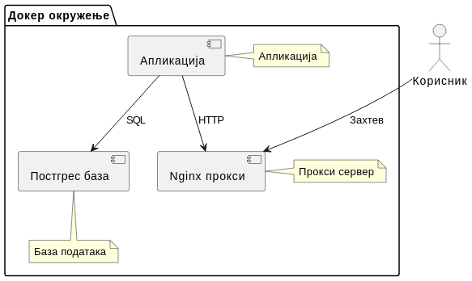

# СПЦ Регистар

Дигитална евиденција за парохије Српске Православне Цркве: парохијани, домаћинства, крштења, венчања, свештеници. Подршка за више парохија у једној инсталацији кроз изоловане Postgres шеме (django-tenants).

---

## Шта апликација ради

- **Регистри** — парохијани, домаћинства, крштења, венчања, свештеници (приказ, претрага, унос, измена, штампа сертификата у PDF-у)
- **Изолација по парохији** — свака парохија је засебна Postgres шема преко [django-tenants](https://django-tenants.readthedocs.io/); подаци не цуре између парохија
- **Улоге** — Админ, Канцеларија, Свештенство, Преглед; писање ограничено по ресурсу, читање захтева пријаву
- **Календар слава** — фиксне и покретне славе, кратки подсетник дана + информације о посту
- **PDF сертификати** — крштенице и венчанице се штампају преко WeasyPrint, са алатима за калибрацију координата

## Брзи почетак

Изаберите ток који вам одговара:

| Пут | За кога | Документ |
|---|---|---|
| **Локални развој (bare-metal, pyenv + Postgres)** | Програмери који желе нативни Python тoolchain | [docs/setup.md](docs/setup.md) |
| **Локални развој (Docker Compose)** | Програмери који желе изоловано окружење | [docs/setup.md#docker](docs/setup.md#docker) |
| **Производња на серверу (gunicorn + systemd + nginx)** | Тренутна продукциона поставка | [docs/deployment.md#bare-metal](docs/deployment.md#bare-metal) |
| **Производња у Docker-у** | Алтернативна продукциона поставка | [docs/deployment.md#docker](docs/deployment.md#docker) |

После постављања, апликација слуша на [http://localhost:8000/](http://localhost:8000/) (или порту 9000 на серверу), а пријава је на `/prijava/`.

## Документација

| Документ | О чему |
|---|---|
| [docs/setup.md](docs/setup.md) | Подешавање развојног окружења (bare-metal и Docker) |
| [docs/deployment.md](docs/deployment.md) | Производна поставка (gunicorn+systemd и Docker) |
| [docs/architecture.md](docs/architecture.md) | Архитектура: django-tenants, ауторизација, кључне компоненте |
| [docs/testing.md](docs/testing.md) | Тестови, pre-commit (ruff + biome + pylint + djlint) |
| [docs/MIGRACIJA.md](docs/MIGRACIJA.md) | Миграција података из старе HramSP апликације (DBF → Postgres) |

## Структура пројекта

Детаљна архитектура и објашњење компоненти: [docs/architecture.md](docs/architecture.md).

## Технолошки стек

- **Backend** — Python 3.13, Django 6.0, [django-tenants](https://django-tenants.readthedocs.io/) (шема-по-парохији)
- **База** — PostgreSQL 16
- **PDF** — [WeasyPrint](https://weasyprint.org/) за крштенице и венчанице
- **Frontend** — Django templates + ванилла CSS/JS (без SPA framework-а), [django-compressor](https://django-compressor.readthedocs.io/) + WhiteNoise
- **Сервер** — gunicorn иза nginx-а (production); systemd unit `spc-registar` (на bare-metal)
- **Линтери** — [ruff](https://docs.astral.sh/ruff/) (Python), [biome](https://biomejs.dev/) (CSS/JS), [djlint](https://www.djlint.com/) (templates), pylint
- **Тестови** — Django `manage.py test` (572+ теста)

## Доприношење

1. Направите грану по конвенцији: `feature/<кратки-опис>` (minor) или `fix/<кратки-опис>` (patch). Остали префикси и детаљи: [CONTRIBUTING.md](CONTRIBUTING.md).
2. Пре пуша покрените: `pre-commit run --files <измењени фајлови>`
3. Отворите Pull Request на главној грани (`main`); auto-tag workflow ће подићи семвер при мерџу (feature → minor, fix → patch)

Више: [CONTRIBUTING.md](CONTRIBUTING.md) (начин рада), [docs/testing.md](docs/testing.md) (тестови).

## Лиценца

Власнички — за интерну употребу унутар парохија Српске Православне Цркве. За другу употребу контактирајте одржаваоца.

## Подршка

Питања и пријаве грешака отворите на [GitHub Issues](https://github.com/zenariworks/spc-registar/issues).
