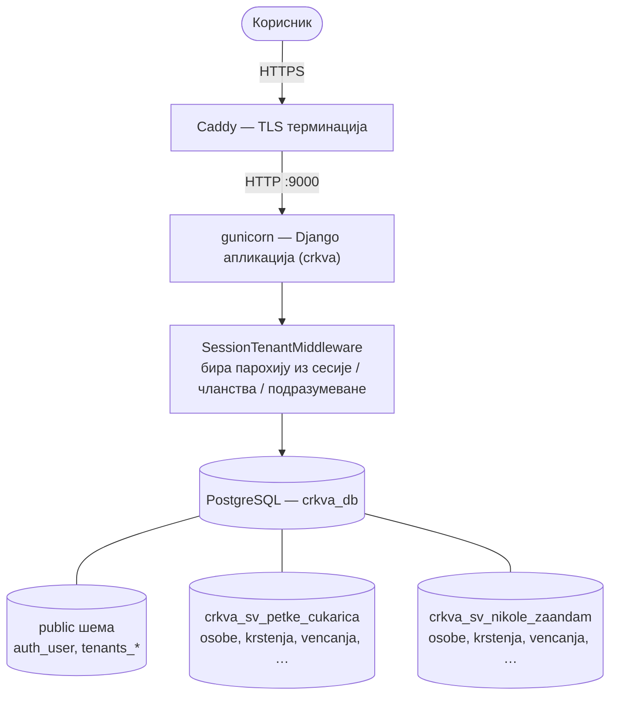
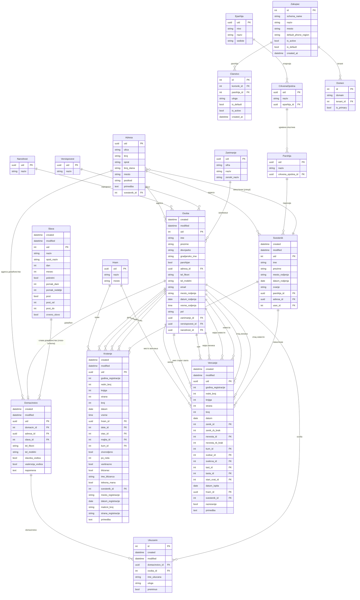

# Архитектура

## Кратак преглед

Django 6.0 апликација иза gunicorn-а и Caddy-ја, PostgreSQL као једина база, [django-tenants](https://django-tenants.readthedocs.io/) за изолацију података по парохији. Frontend је server-rendered (Django templates + ванилла CSS/JS), без SPA framework-а. PDF сертификати се генеришу WeasyPrint-ом.



## Структура репозиторијума

```
spc-registar/
├── crkva/                      # Django пројекат (име: crkva)
│   ├── crkva/                  # Сетинзи + root URLConf + WSGI
│   │   ├── settings.py
│   │   ├── urls.py             # /healthz, /readyz, /admin, /parohija, /
│   │   └── wsgi.py
│   ├── registar/               # Главна апликација (регистри)
│   │   ├── models/             # Osoba, Domacinstvo, Krstenje, Vencanje, Svestenik, Adresa...
│   │   ├── views/              # CBV + FBV; сви имају LoginRequiredMixin / @login_required
│   │   ├── forms/              # ModelForms + TenantPhoneField
│   │   ├── templates/registar/ # Детаљни шаблони (krstenje.html, parohijan.html...)
│   │   ├── static/registar/    # CSS (BEM, дизајн-токени), JS (ванилла)
│   │   ├── management/commands/# DBF import, миграциони one-shots
│   │   ├── migrations/         # Django миграције за registar шему
│   │   └── tests/              # 950+ unit + интеграционих тестова
│   ├── tenants/                # django-tenants апликација (Tenant, Domain, Role, UserMembership)
│   │   ├── models.py
│   │   ├── permissions.py      # tenant_role_required, tenant_admin_required, can_edit
│   │   └── migrations/         # Миграције за public шему
│   ├── kalendar/               # Slava модел + покретне славе
│   └── manage.py
├── scripts/
│   ├── gunicorn.conf.py        # gunicorn config (порт 9000)
│   ├── backup.sh               # pg_dump целе базе
│   └── migration/              # помоћни скриптови за migracija_*
├── docs/                       # Ова документација
├── biome.json                  # CSS/JS линт правила
├── .pre-commit-config.yaml     # ruff, ruff-format, isort, autoflake, pylint, biome, djlint
├── pyproject.toml
└── docker-compose.yml          # јединствени стек (профили: dev/standalone/prod)
```

## Django-tenants: изолација по парохији

Свака парохија је засебна **Postgres шема** у истој бази:

```
postgres-db: crkva
├── public                          ← дељене табеле (Tenant, Domain, UserMembership, auth_user)
├── crkva_sv_petke_cukarica         ← парохија "Свете Петке у Чукарици"
│   ├── osobe, domacinstva, krstenja, vencanja, svestenici, hramovi, adrese...
├── crkva_sv_nikole_zaandam         ← парохија "Светог Николе у Зандаму"
│   └── (исте табеле, потпуно одвојени подаци)
└── test_tenant                     ← коришћен за тестове
```

- **Дељене (SHARED_APPS)** — `django.contrib.*`, `tenants`, `kalendar`, `django_select2`, `simple_history` → у public шеми
- **Тенант-специфичне (TENANT_APPS)** — само `registar` → копија у свакој шеми (укључујући `registar_historical*` ревизионе табеле)

### Како се рутира тенант

`tenants.middleware.SessionTenantMiddleware` за сваки захтев резолвира тренутног тенанта (из сесије, па чланства корисника, па подразумеване парохије), поставља `connection.schema_name` на `tenant_schema, public`, и враћа на `public` по завршетку захтева. Сви upit-и у том request-у иду у изабрану шему. Рутирање **није** по домену/субдомену.

### Креирање нове парохије

```bash
python manage.py shell -c "
from tenants.models import Tenant
t = Tenant(
    schema_name='crkva_sv_jovana_nis',   # само ASCII слова, цифре, доње црте
    naziv='Парохија Ниш',
    parohija_naziv='Парохија Ниш',
    default_phone_region='RS',
    is_active=True,
)
t.save()  # auto_create_schema=True → шема се креира и миграције се покрећу одмах
"
```

Затим напуните податке истим током као у [`MIGRACIJA.md`](MIGRACIJA.md) (`tenant_command ... --schema=crkva_sv_jovana_nis`).

## Ауторизација

Сви request-ови захтевају пријаву (`@login_required` / `LoginRequiredMixin`); анонимни саобраћај иде на `/prijava/?next=<rutu>`. Писање је уско по улози.

### Улоге (`tenants.models.Uloga`)

`Uloga` је `TextChoices`; вредност се чува у `Clanstvo.uloga`, подразумевано `PREGLED`.

| Улога | Вредност у бази | Шта може да пише | Где |
|---|---|---|---|
| `Uloga.ADMIN` — Администратор | `admin` | Све у тенанту | `osoba`, `domacinstvo`, `krstenje`, `vencanje`, `svestenik` |
| `Uloga.KANCELARIJA` — Канцеларија | `kancelarija` | Парохијане, домаћинства, крштења, венчања | све изузев `svestenik` |
| `Uloga.SVESTENSTVO` — Свештенство | `svestenstvo` | Свештеници | само `svestenik` |
| `Uloga.PREGLED` — Преглед | `pregled` | Ништа — само чита | — |

Дефинисано у `crkva/tenants/permissions.py:WRITE_BY_ROLE`. Superuser заобилази проверу. Декоратор `@tenant_role_required("osoba")` се ставља изнад view-a који пише.

### Шема ауторизације

- **Anonymous** → `/prijava/` (login)
- **Authenticated** → све `Spisak*`, `Prikaz*`, `*PDF` view-ове, `index`, `kalendar`, `search`, `search_autocomplete`
- **Role check (`can_edit`)** → `unos_*`, `izmena_*`, `brzi_*`, `calibrate_*`
- **Tenant admin** → корисничко управљање (`tenants/views.py`)

## Кључне компоненте

### Модели

18 модела: 14 у `registar` (тенант шема), 3 у `tenants` (public шема), 1 у `kalendar` (public шема, дељен).

#### Језгро — тенант шема

| Модел | Табела | Улога |
|---|---|---|
| `Osoba` | `osobe` | Једина „person“ табела — и парохијани и све остале особе из записа (родитељи, кумови). `parohijan=True` издваја парохијане. FK: `adresa`, `zanimanje`, `veroispovest`, `narodnost`. |
| `Domacinstvo` | `domacinstva` | Домаћинство. `domacin` је OneToOne на `Osoba`; FK `adresa`; FK `slava` (**cross-schema**, `db_constraint=False`). Заставице `slavska_vodica` / `vaskrsnja_vodica`. |
| `Ukucanin` | `ukucani` | Join `Domacinstvo` ↔ `Osoba`, са `uloga` (домаћин / супружник / дете / рођак / остало) и `preminuo`. `ime_ukucana` је резервно име кад особа није повезана (за старије преминуле). Unique `(domacinstvo, osoba)` кад `osoba` постоји. |
| `Krstenje` | `krstenja` | Запис крштења. FK на учеснике: `dete`, `otac`, `majka`, `kum` (све `Osoba`), плус `hram` и `svestenik`. Књиговодство: `knjiga`, `strana`, `broj`, `redni_broj`, `godina_registracije`. |
| `Vencanje` | `vencanja` | Запис венчања. FK на учеснике: `zenik`, `nevesta`, `kum`, `svekar`, `svekrva`, `tast`, `tasta`, `stari_svat` (све `Osoba`), плус `hram` и `svestenik`. Исто књиговодство као `Krstenje`. |
| `Svestenik` | `svestenici` | Свештеници — посебан скуп људи, не унакрсно са `Osoba`. `zvanje` из фиксне листе (јереј, протојереј, …); FK `parohija`, `adresa`; OneToOne `user` (**cross-schema**, `db_constraint=False`). |
| `Adresa` | `adrese` | Улица, број, спрат, стан, место, поштански број. FK `svestenik` = свештеник задужен **за ту улицу** (#26 — подела територије парохије за васкршњу водицу). Unique по нормализованим (`Lower`) `ulica`, `broj`, `broj_stana`, `mesto`. |

`Krstenje`, `Vencanje` и `Domacinstvo` имају `uid` (UUID) као primary ID — отуда UUID у URL-овима. `Osoba` и `Svestenik` користе `AutoField`.

#### Шифарници — тенант шема

| Модел | Табела | Улога |
|---|---|---|
| `Narodnost` | `narodnosti` | Само `naziv`. Case-insensitive unique. |
| `Veroispovest` | `veroispovesti` | Само `naziv`. Case-insensitive unique. |
| `Zanimanje` | `zanimanja` | `sifra`, `naziv`, `zenski_naziv`. Case-insensitive unique по `naziv`. |
| `Eparhija` | `eparhije` | `nivo` (Епархија / Архиепископија / Митрополија), `naziv`, `sediste`. |
| `CrkvenaOpstina` | `crkvene_opstine` | `naziv` + FK `eparhija`. |
| `Parohija` | `parohije` | `naziv` + FK `crkvena_opstina`. **Није** исто што и `tenants.Zakupac` — ово је шифарник унутар тенанта, којим се везује свештеник. |
| `Hram` | `hramovi` | `naziv`, `mesto`. |

`Narodnost`, `Veroispovest` и `Zanimanje` нормализују `naziv` у `save()` **и** преко `NazivQuerySet` (`registar/models/_naziv.py`) на `bulk_create` / `bulk_update` путањама — иначе би bulk упис заобишао case-insensitive ограничење (#298).

#### Public шема

| Модел | Табела | Улога |
|---|---|---|
| `Zakupac` | `tenants_tenant` | Тенант = парохија (`TenantMixin`). `schema_name`, `naziv`, `mesto`, `default_phone_region`, `is_active`, `is_default`. `auto_create_schema=True`. |
| `Domen` | `tenants_domain` | `DomainMixin` — постоји јер га django-tenants захтева; рутирање **није** по домену (види горе). |
| `Clanstvo` | `tenants_user_membership` | Веза `User` ↔ `Zakupac` плус `uloga`. `is_default` бира парохију при пријави. |
| `Slava` | `slave` | Фиксне (`dan` / `mesec`) и покретне (`pomak_dani` / `pomak_nedelje` од Васкрса) славе; постови, црвена слова. Методе `get_datum(year)`, `get_post(year)`, `sracunaj_vaskrs(year)`. Дељена — али `Domacinstvo.slava` је зато cross-schema FK. |

`Uloga` (`tenants/models.py`) није модел него `TextChoices` — скуп вредности за `Clanstvo.uloga`; шта која улога сме види у [Ауторизација](#ауторизација).

#### Релације

Дијаграм испод **није писан руком** — генерише га `scripts/er_dijagram.py`
интроспекцијом самих модела (колоне, PK/FK, кардиналност, `verbose_name` као
ознака везе). Регенерисање после промене модела:

```bash
cd crkva && python ../scripts/er_dijagram.py --upisi
```

`--check` пада ако је блок испод застарео у односу на моделе; тако дијаграм не
може тихо да оде из корака (за разлику од прозе изнад, коју и даље одржавамо
руком).

<!-- er:start -->



<!-- er:end -->

Кључни модели (`Krstenje`, `Vencanje`, `Osoba`, `Svestenik`, `Domacinstvo`, `Adresa`, `Ukucanin`) користе [`simple_history`](https://django-simple-history.readthedocs.io/) за audit лог промена — свака тенант шема зато носи и пратеће `registar_historical*` табеле.

> За детаљан ER приказ саме SQL шеме (нпр. увоз у [dbdiagram.io](https://dbdiagram.io/)) покрени `./scripts/schema_dump.sh` — генерише `schema.sql` за изабрану тенант шему (подразумевано `crkva_sv_petke_cukarica`; промени преко `TENANT_SCHEMA=…`).

### Forms

- **`TenantPhoneField`** (`registar/forms/phone.py`) — телефонско поље које регион чита из `connection.tenant.default_phone_region` (RS, NL, DE, ...) тако да парохија ван Србије може да користи свој позивни број.
- Сви ModelForm-ови наслеђују `Meta.fields` експлицитно (не `__all__`) ради безбедности.

### Темплате-tag-ови

- **`info_components`** (`registar/templatetags/`) — пружа ``, ``, `` за DRY рендерирање детаљних страница.
- **`marker_filter`** — означава претражене речи (са HTML escape пре `mark_safe`).
- **`form_errors_extras`** — конвертује `form.errors` у `{field: [str]}` JSON, користи се са `json_script` за inline error UX.

### Frontend архитектура

- CSS токени у `static/registar/base/tokens.css` — све боје преко `var(--color-*)`, тема (`light`, `sepia`, `tamna`) се ради преко override-a у `themes/*.css`
- BEM конвенција за класе (`.info-row__icon`, `.tab-group--with-panels`)
- JS је ванилла + jQuery (за django-select2), нема билд корака за апликациони код
- [Biome](https://biomejs.dev/) линтер за CSS/JS (`biome.json`)

### URL шема

```
/healthz                     liveness probe (без auth)
/readyz                      readiness probe (DB ping; без auth)
/admin/                      Django admin
/parohija/                   тенант UI (tenants app)
/prijava/                    login
/odjava/                     logout
/                            home (slava календар)
/parohijani/                 списак парохијана
/parohijan/<uid>/            детаљи парохијана
/parohijan/print/<uid>/      PDF
/krstenja/, /krstenje/<uid>/, /krstenje/print/<uid>/
/vencanja/, /vencanje/<uid>/, /vencanje/print/<uid>/
/domacinstva/, /domacinstvo/<uid>/
/svestenici/, /svestenik/<uid>/, /svestenik/print/<uid>/
/slava-kalendar/             календар слава
/search/                     претрага
/unos/<resurs>/              нови запис
/izmena/<resurs>/<uid>/      измена записа
/api/brzi-unos-osobe/        AJAX за брзо креирање особе
/api/brzi-izmena-adrese/<uid>/ AJAX за измену адресе
```

## База података

Шему и FK-ове можете видети на [dbdiagram.io/d/65319d89ffbf5169f00f803f](https://dbdiagram.io/d/65319d89ffbf5169f00f803f).

## Settings

| Окружење | Извор |
|---|---|
| Локални развој | `.env.dev.example` → копирати у `.env` |
| Производња | `.env.prod.example` → копирати у `.env` са продукционим вредностима |

Кључне променљиве — види `crkva/crkva/settings.py:36+`:

- `DEBUG` — мора бити `0` у продукцији
- `SECRET_KEY` — никад не оставити вредност из примера
- `DB_*` — host, port, name, user, pass
- `ALLOWED_HOSTS` — листа домена; никад `*` у продукцији

## CI / аутоматизација

`.github/workflows/`:

| Workflow | Шта ради |
|---|---|
| `pylint.yml` | Pylint на Python кôду при сваком push-у |
| `hadolint.yml` | Линт Dockerfile-а |
| `docker-build.yml` | Изградња + push на Docker Hub при merge-у у main |
| `auto-tag.yml` | Подиже семвер тег при merge-у (feature → minor, fix → patch) |
